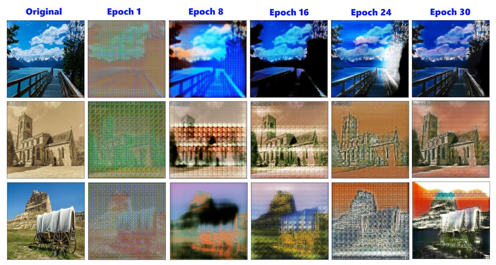
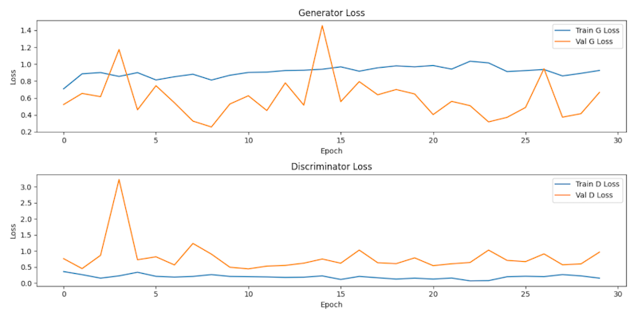

# Monet Style Transfer using GANs

## Overview

This project aims to transfer the artistic style of Monet paintings to ordinary photos using Generative Adversarial Networks (GANs). The core of this project is to train a GAN model that learns the style of Monet paintings and applies it to new images.

## Generative Adversarial Networks (GANs)

Generative Adversarial Networks (GANs) are a class of machine learning frameworks designed by Ian Goodfellow and his colleagues in 2014. GANs consist of two neural networks: the Generator and the Discriminator. The Generator creates new data instances, while the Discriminator evaluates them. The training process involves these two networks playing a min-max game where the Generator tries to produce realistic data to fool the Discriminator, and the Discriminator tries to distinguish between real and generated data. This adversarial process helps the Generator learn to create highly realistic data over time.

## CycleGAN

CycleGAN is a specific type of GAN designed for unpaired image-to-image translation tasks. Introduced by Jun-Yan Zhu et al. in 2017, CycleGAN enables the transformation of images from one domain to another without needing paired examples. It utilizes two sets of GANs: one for the forward transformation and one for the reverse transformation. The key innovation of CycleGAN is the introduction of a cycle consistency loss, which ensures that translating an image to the target domain and then back to the original domain returns the original image. This cycle consistency loss helps in preserving important attributes of the images and enables effective training with unpaired datasets.

## Dataset

The dataset contains four directories: `monet_tfrec`, `photo_tfrec`, `monet_jpg`, and `photo_jpg`. Each directory contains images in different formats:

- `monet_jpg`: 300 Monet paintings sized 256x256 in JPEG format.
- `monet_tfrec`: 300 Monet paintings sized 256x256 in TFRecord format.
- `photo_jpg`: 7028 photos sized 256x256 in JPEG format.
- `photo_tfrec`: 7028 photos sized 256x256 in TFRecord format.

## Training

The training process involves using a GAN architecture consisting of a generator and a discriminator. The generator learns to create Monet-style images from photos, while the discriminator learns to distinguish between real Monet paintings and generated images.

### Key Steps in Training:

1. **Data Preparation**: Loading and preprocessing images.
2. **Model Building**: Defining the generator and discriminator architectures.
3. **Training**: Adversarial training of the GAN.
4. **Evaluation**: Using metrics like FID (Fréchet Inception Distance) to evaluate the quality of generated images.

## Results

The trained model generates high-quality Monet-style images from ordinary photos. The quality of the generated images is evaluated using various metrics, and visual inspection shows convincing style transfer.

## Future Work

- **Hyperparameter Tuning**: Experiment with different hyperparameters to improve model performance.
- **Regularization Techniques**: Implement regularization methods to enhance stability and generalization.
- **Advanced Architectures**: Explore advanced GAN architectures like StyleGAN.

## References

- [Kaggle: GANs Getting Started](https://www.kaggle.com/competitions/gan-getting-started/overview)
- [YouTube: Generative Adversarial Networks (GANs) - Computerphile](https://www.youtube.com/watch?v=TpMIssRdhco)
- [YouTube: Machine Learning with Generative Adversarial Networks (GANs)](https://www.youtube.com/watch?v=5jziBapziYE)
- [YouTube: Advanced Techniques in GANs](https://www.youtube.com/watch?v=_pIMdDWK5sc)
